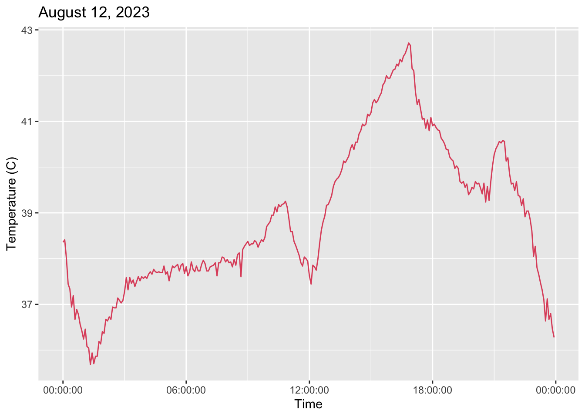
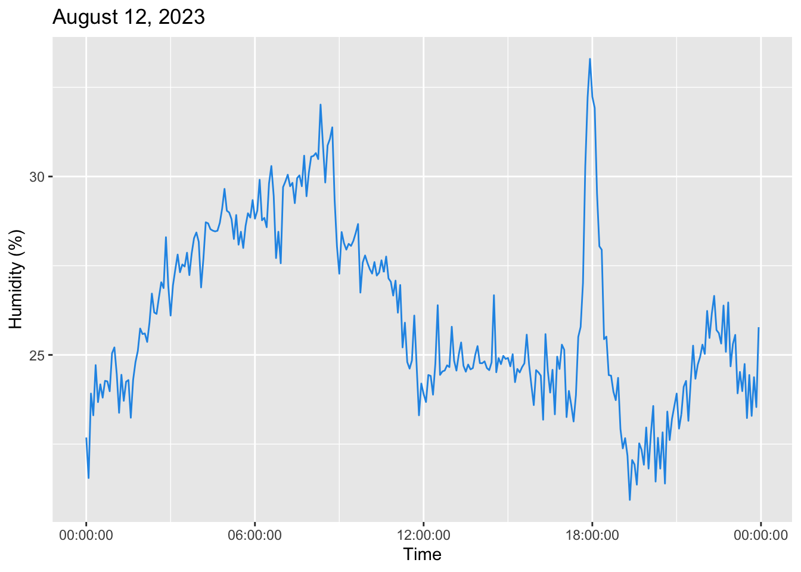
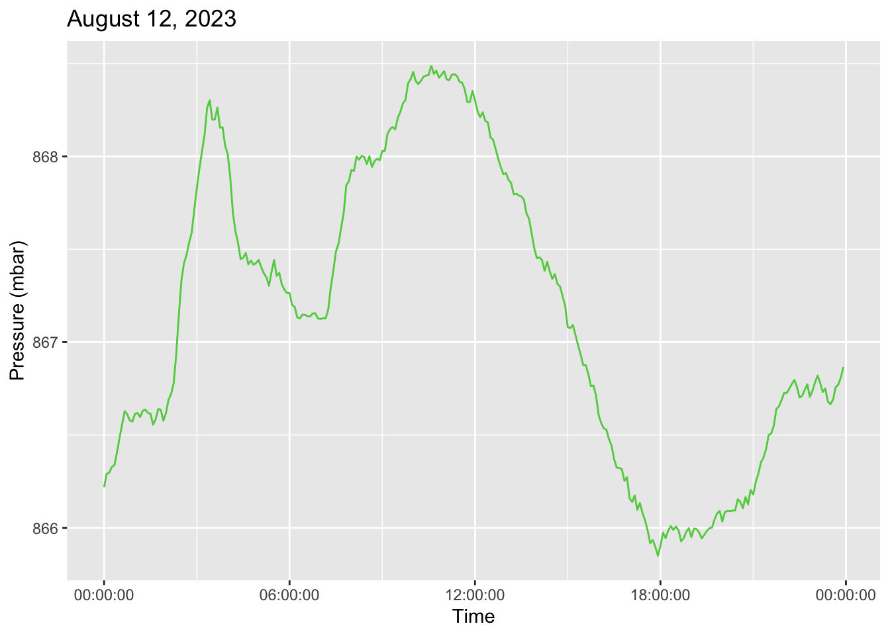

---
# Feel free to add content and custom Front Matter to this file.
# To modify the layout, see https://jekyllrb.com/docs/themes/#overriding-theme-defaults
title: "Ambience Database"
layout: page
background: "/img/SenseHat.jpg"
---

The idea here is to record ambient state of my residence.

## What's the Impetus? 

As I've aged, the quality of my sleep has deteriorated.  Naturally, I'd like to fix this.  How might I go about doing so?  Collect data.

This page is limited to how I record ambient measures of the room in which I regularly sleep.  My hope is to combine this with the sleep quality data from a wearable to identify any trends.

### The Set Up

I have a [raspberrypi](https://www.raspberrypi.com/) with a [SenseHat](https://www.raspberrypi.com/products/sense-hat/) attachment.   After installing the [sense-hat python package](https://pythonhosted.org/sense-hat/), I created a script which records each of the following
- Temperature (in Celcius)
- Pressure (in Millibars)
- Humidity (percentage)
- Orientation (in degrees)
   + pitch 
   + roll
   + yaw
- Acceleration (in G's)
   + pitch
   + roll
   + yaw  

to a dated csv stored on the pi.  This script then runs at an arbirary time interval via [cron](https://en.wikipedia.org/wiki/Cron)---currently set to every five minutes.  Note, unless my neighbors are especially amorous or [another earthquake hits SLC](https://en.wikipedia.org/wiki/2020_Salt_Lake_City_earthquake), I don't expect much variation in orientation or acceleration.

I have also set up a [PostgreSQL](https://www.postgresql.org/) database and schema in which to store these data.   This is accomplished through an [Airflow](https://airflow.apache.org/) [DAG](https://airflow.apache.org/docs/apache-airflow/stable/core-concepts/dags.html#dags) on a daily basis.  Both the postgres database and the Airflow instance are hosted locally on a home server.

## Where Things Stand  

The data look as follows:  

```
# select * from ambience.readings limit 5;  
  reading_id              |         reading_dttm          |        temp        |     pressure     |      humidity      |        pitch        |        roll         |        yaw        |        accel_x        |        accel_y        |      accel_z       | location_id
 27a460d1-928a-49e1-a33f-62c4606fbbcf | 2022-12-29 00:00:02.932521-07 | 22.219310760498047 |   859.7646484375 |  35.38669204711914 |    0.34020350498699 |  0.0418293824830006 | 94.41492750094768 | -0.004689877387136221 | 0.0009711703169159591 | 0.9981822967529297 |           1
 50ceb4c5-c04e-4497-9eac-2a643d5fd697 | 2022-12-29 00:05:02.104901-07 | 22.972414016723633 |  859.77880859375 |  33.82246017456055 | 0.29746076813043193 | 0.06966456780039794 | 91.60975514844512 | -0.004689877387136221 | 0.0009711703169159591 | 0.9991570711135864 |           1
 ca54aa1e-a92e-4bbe-b367-be8f61d17c97 | 2022-12-29 00:10:02.276927-07 |  23.45655059814453 | 859.777099609375 | 32.911014556884766 | 0.34036972404374455 | 0.05579976736800138 |  96.9448090789529 | -0.005430384073406458 | 0.0009711703169159591 | 0.9986696839332581 |           1
 25e3f8c9-ab45-4785-baf1-37095a4ebb97 | 2022-12-29 00:15:02.45868-07  | 22.918621063232422 |    859.775390625 | 33.646942138671875 | 0.35420520602253097 | 0.05574527259698673 | 91.45738728844047 | -0.005677219945937395 | 0.0016995479818433523 | 0.9974511861801147 |           1
 24d3f874-8e1e-4337-96e8-e029dcbf5337 | 2022-12-29 00:20:02.712625-07 | 22.524137496948242 | 859.703369140625 | 34.145774841308594 | 0.36810341368389043 | 0.05570447155484516 | 92.92499686559027 | -0.006170891225337982 | 0.0009711703169159591 | 0.9989133477210999 |           1
```

Below and Above, `LOCATION_ID` indicates the physical location as described in the `ambience.location` table, e.g. address, etc. of the pi (information I'm not keen to share publicly).  
As of August 20, 2023, the queries below have the following results.  

```
# select location_id,min(reading_dttm),max(reading_dttm) from ambience.readings group by location_id;
1 | 2022-12-27 00:00:02.845534-07 | 2023-08-18 23:55:02.191325-06

# select location_id,count(*) as reading_count from ambience.readings group by location_id;
1 |        463939
```

When graphed in R's ggplot the data appear as follows.  





### Possible Extensions

~~Create a recurring jupyter notebook or Rmarkdown report which demonstrates the database state, updated on a regular basis.~~
[Done](https://snyderjo.github.io/ambience_sleep/)!

Adding a second raspberrypi-sensehat, placing it in my living room to look for any deviations between rooms.  

Comparing the ambient measures in my bedroom (and/or living room) against the external weather to estimate my electricity and/or heating bill.  


## Concluding Thoughts

Does this code make use of best practices?  
*Likely not.  I make no claims to being a data engineer.*  

Does it work?  
*It does.*  

Have you done anything with this data?  
*I have produced two reports that update regularly.*  

# Tools Applied / Learned 

<table style="padding:30px;font-size:17px;">

<br>

<tr>
    <td align="center">
        <div>
            <a href="https://airflow.apache.org/" target="_blank"></a>
        </div>
    </td>
    <td  align="center">
        <div>
            <a href="https://www.postgresql.org/" target="_blank"></a>
        </div>
    </td>
    <td  align="center">
        <div>
            <a href="https://www.raspberrypi.com/" target="_blank"></a>
        </div>
    </td>
</tr>
<tr>
    <td>
        <div>
            <p style="text-align:center">Airflow is a remarkably robust scheduling tool, commonly used in ETL processes.  Here, I use it to pull data recorded on and by the pi to the database.</p>
        </div>
    </td>
    <td >
        <div>
            <p style="text-align:center">Postgres a.k.a. PostgreSQL is a free and open-source Relational Database Management System---a flavor of SQL database.  It is the distribution I use to store the data.</p>
        </div>
    </td>
    <td >
        <div>
            <p style="text-align:center">RaspberryPi's are remarkable!  They have any number of <a href="https://projects.raspberrypi.org/en/projects" target="_blank">applications and potential projects</a>.</p>
        </div>
    </td>
</tr>
</table>

<br>
